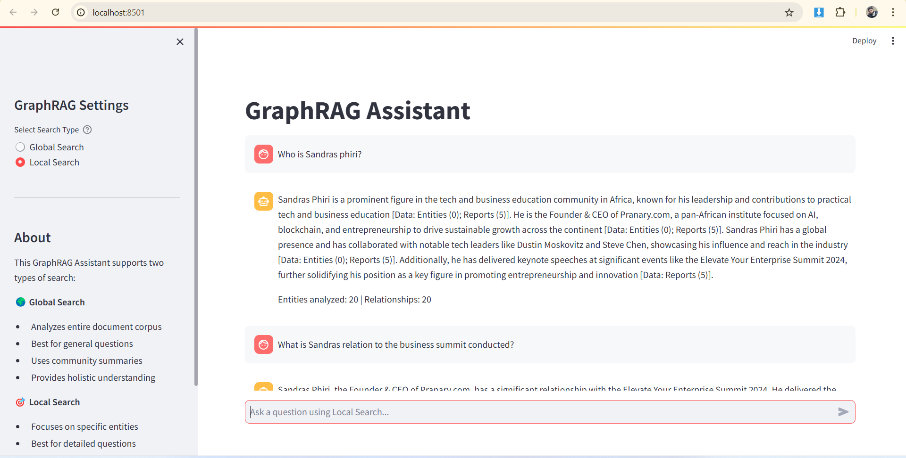

# GraphRAG Chatbot

RAG-based chatbot implementation using Graph RAG (Retrieval Augmented Generation) with Streamlit UI. This implementation uses Microsoft Research's GraphRAG approach, providing superior context awareness and reasoning capabilities compared to traditional RAG systems.

## 🤔 Why GraphRAG?

Traditional RAG systems, while useful, face several limitations when dealing with complex information retrieval and reasoning tasks. GraphRAG addresses these limitations through a structured, hierarchical approach:

### Limitations of Traditional RAG:

1. **Limited Connection Synthesis**: Basic RAG struggles to "connect the dots" between related pieces of information that aren't explicitly linked.
2. **Poor Holistic Understanding**: Traditional approaches have difficulty comprehending and summarizing broad semantic concepts across large document collections.
3. **Context Loss**: Simple vector similarity search can miss important contextual relationships.

### GraphRAG Advantages:

1. **Knowledge Graph Structure**:

   - Creates an LLM-generated knowledge graph from your input corpus.
   - Captures complex relationships between entities.
   - Enables traversal of related concepts through shared attributes.

2. **Hierarchical Understanding**:

   - Uses the Leiden technique for hierarchical clustering.
   - Generates community-level summaries.
   - Provides both granular and holistic views of information.

3. **Advanced Query Processing**:

   - **Global Search**: For reasoning about holistic questions across the entire corpus.
   - **Local Search**: For a detailed exploration of specific entities and their relationships.

4. **Enhanced Context Window**:

   - Use community summaries for better context.
   - Maintains relationship awareness during queries.
   - Improves synthesis of information from multiple sources.

## 🚀 Quick Start

### Prerequisites

- Python 3.8 or higher
- Git
- OpenAI API key

### Installation

1. Clone the repository

```bash
git clone it@github.com:Saifullah3711/graph_rag.git
cd graph_rag
```

2. Install required dependencies

```bash
pip install -r requirements.txt
```

3. Set up `secrets.toml`

- Create a `.streamlit` folder in the root directory.
- Inside `.streamlit`, create a `secrets.toml` file.
- Add your OpenAI API key to the `secrets.toml` file:

```toml
[general]
GRAPHRAG_API_KEY = "your_openai_api_key"
```

This setup is especially useful for deploying the app to **Streamlit Cloud**.

### Streamlit Cloud Deployment

To deploy the app on Streamlit Cloud for demo purposes:
1. Ensure your `secrets.toml` file is correctly set up as described above.
2. Push your code to a GitHub repository.
3. Link your repository to Streamlit Cloud and deploy the app.

## 💻 Usage

### Running the Chatbot

To run the chatbot locally:

```bash
streamlit run st_chatbot.py
```

This will launch the Streamlit interface in your default web browser.

### Using Your Own Data

To use your own data with the chatbot, follow these steps:

1. **Prepare Your Data**:
   - Create an `input` folder in the root directory.
   - Place your text documents (`.txt` files) in this folder.

2. **Initialize GraphRAG**:

```bash
python -m graphrag.index --init --root .
```

3. **Index Your Documents**:

```bash
python -m graphrag.index --root .
```

4. **Add More Documents (Optional)**:
   - Add new `.txt` files to the `input` folder.
   - Re-run the indexing process:

```bash
python -m graphrag.index --root .
```

5. **Launch the Chatbot**:

```bash
streamlit run st_chatbot.py
```

## 🛠️ How It Works

GraphRAG follows a sophisticated process:

1. **Indexing Phase**:
   - Document Slicing: Breaks down documents into manageable TextUnits.
   - Entity Extraction: Identifies key entities, relationships, and claims.
   - Clustering: Groups related information using the Leiden technique.
   - Summary Generation: Creates hierarchical summaries of communities.

2. **Query Phase**:
   - Global Search: For corpus-wide understanding.
   - Local Search: For entity-specific exploration.
   - Context Enhancement: Uses community structures for better responses.

## 🎯 Features

- Interactive Streamlit UI.
- Graph-based retrieval.
- Hierarchical information processing.
- Community-aware responses.
- Source tracking.
- Context-rich answers.
- Entity relationship mapping.

## ⚠️ Limitations

- Currently supports only `.txt` files.
- Requires OpenAI API key, which could be costly for large documents.
- Initial processing time for large documents.
- Resource intensive for very large datasets.

## 🤝 Contributing

Contributions are welcome! Please feel free to submit a Pull Request.

## 📣 Support

If you encounter any issues or have questions, please open an issue in the GitHub repository.

## 📚 References

- [Microsoft Research Blog Post on GraphRAG](https://microsoft.github.io/graphrag/)
- [GraphRAG Academic Paper](https://arxiv.org/pdf/2404.16130)
- [Official GraphRAG Documentation](https://github.com/microsoft/graphrag)
- [Streamlit Chatbot docs](https://docs.streamlit.io/develop/tutorials/llms/build-conversational-apps)

## Streamlit UI


